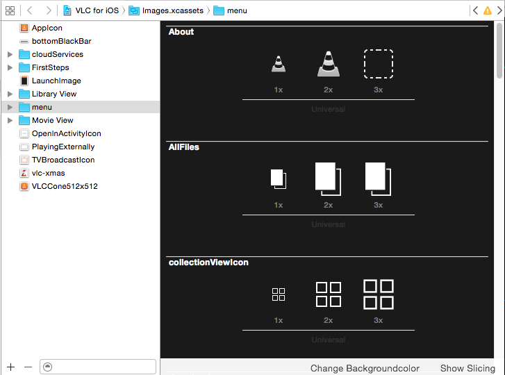

# TOCAssetCatalogBackground
Xcode plugin to switch between white and dark background color in the asset catalog viewer.

## Installation

Either

- Clone and build the plugin yourself, it will be installed to the right location automatically by building it.

or

- Install it via [Alcatraz](http://alcatraz.io/)

In any case, relaunch Xcode to load it.

## License
MIT License, see LICENSE.txt.